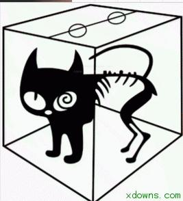

# 稿-1
### 名字
- 薛定谔的业效空间\社区\频道 (强调业效)
- 薛定谔的一〇空间\社区\频道 (二进制10)
- 薛定谔的搬砖记录 (自嘲)
### 简介
- 这里的内容正处在“你可能知道”和“你可能不知道”的叠加状态，快点开看看吧:)
### logo
- 如图，把盒子内的猫换成一只小牛(简笔画的牛，侧身)，颜色弄阳光点，和公司一样线条用蓝色(暗示公司，这样不知道行不行？别人会不会以为是rancher。。。)；右半边不要画成图中的骨架，看着不舒服，相比左边画瘦点？(左边的前半身线条粗，右半边线条细)
 

### 名字的初衷
- 名字出自薛定谔的猫，这一物理学加哲学问题(感觉格调高点)
- 名字和简介不想显得太功利，想显得有趣一些；
    - 不想给人一种这东西对我工作有用还是没用的价值判断，应该是给人一种第一眼看上去还有点意思的感觉；
    - 简介这么写一是切合名字，二是想降低读者的预期，有利于之后的完善和提高；
- 对于我们和读者这个公众号都是叠加状态；
    - 我们不去做，也不会知道我们会不会做的好；不去写，也不知道写这些会带给我们多少价值；写了才知道；
    - 对于读者，不看怎么知道我们写的好不好；
